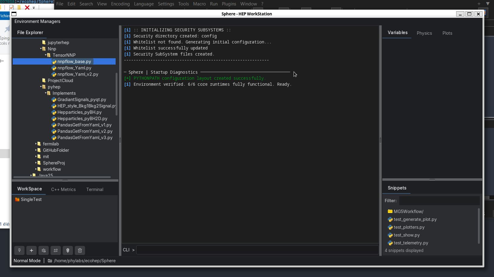
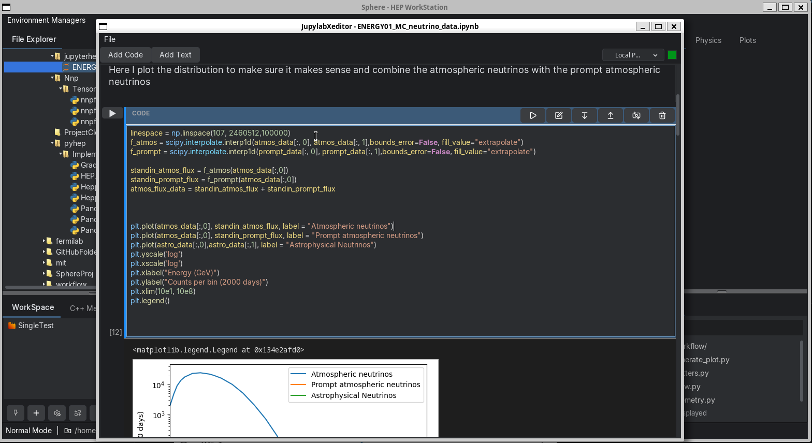
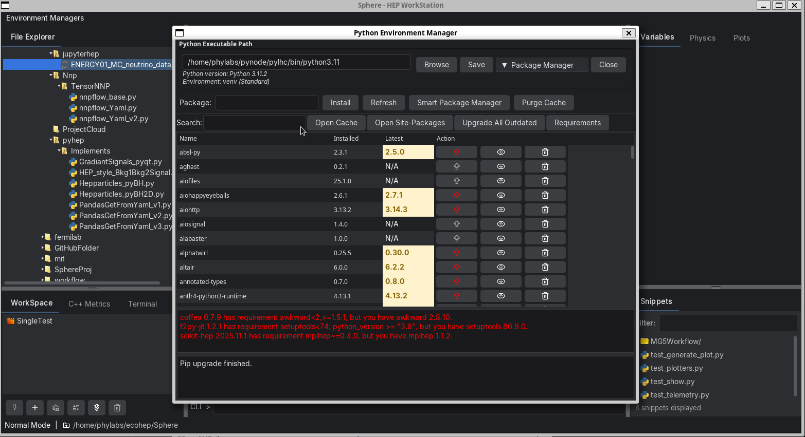
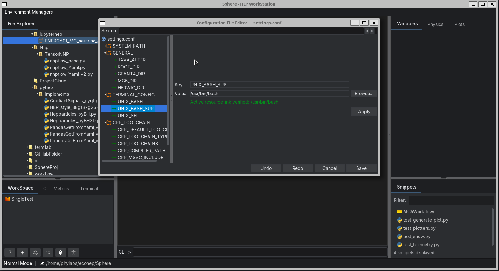
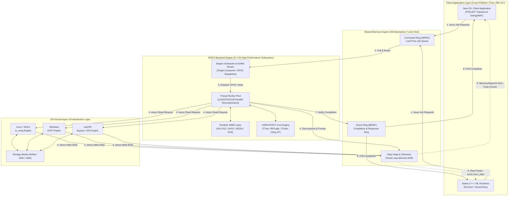

# Sphere (Science Physic High Energy Research Environment)

**Sphere** functions as an experimental environment (a sandbox) or an advanced visual REPL. It allows to test scripts, run code on the fly, and inspect data without having to recompile large applications.

## Expanding Toward a Full HEP Simulation Pipeline
My long‑term objectives also include integrating Geant4, MG5, and Herwig, in order to extend the system into a full HEP simulation and analysis pipeline.






## **Why It Is a Sandbox**

### **• On‑the‑fly execution**  
The interactive CLI lets you inject and test code snippets in C++, Python, Julia in real time.

### **• Isolated and self‑contained environment**  
The application includes its own variable managers, an internal code editor (`QuickCodeEditorFrame`), integrated terminals, and a temporary workspace.

### **• Safe diagnostics**  
It provides telemetry tools (`CppMetricsPanel`) and startup diagnostics to evaluate memory performance or physics computations live.

---

## **Important Distinction**

Unlike a security sandbox (which isolates a program to prevent access to the system), **Sphere is a development and analysis sandbox**—similar to a Jupyter Notebook or an enhanced MATLAB/ROOT console.

It has direct access to hardware, native storage, and processors to deliver maximum performance.

**Sphere is a scientific desktop platform (IDE / Workbench) dedicated to High Energy Physics (HEP).**  
Developed in **Java/Swing** with a modern dark theme, it serves as an execution environment, diagnostic tool, and interactive control interface.

---

# **Architecture & Key Features**

## **Polyglot Execution Engine (Multi‑Mode)**  
An interactive CLI with autocompletion (global TAB interception) and command history (Ctrl+R, arrow keys) allows dynamic switching between multiple languages and environments (C++, Python, Julia, etc.).

---

## **Native C++ Backend & CERN ROOT Integration**  
Sphere embeds a highly optimized C++ backend (`CppBackend`, `CppDiagnosticsEngine`) and communicates with CERN ROOT through a native bridge (`RootBackend` / `RootBridgeCompiler`).

---

## **Modular Graphical Interface**

### **• Explorer & Editor**  
- File manager (`FileExplorer`)  
- Code panel (`Snippets`)  
- Internal editor (`QuickCodeEditorFrame`)

### **• Monitoring & Terminal**  
- C++ performance metrics (`CppMetricsPanel`)  
- Workspace manager (`Workspace`)  
- Integrated system terminals (Bash, CMD)

### **• Scientific Utilities**  
- Variable inspection panels  
- Physics calculation tools  
- Graphical visualization modules (`Plots`)
- etc...

---

## **Robustness & Performance**

- Asynchronous execution (`CompletableFuture`) to keep the GUI responsive  
- Telemetry tracking  
- Startup diagnostics (`StartupDiagnostic`)  
- Automated resource cleanup via shutdown hooks


## High-Performance Cross-Platform Hybrid Architecture & Native Java Interoperability

## ROOT Data Integration Layer

The **root-bridge** is a high-performance C++20 subsystem that acts as an ultra-low latency, zero-copy data and rendering gatekeeper between raw ROOT storage (`.root` files, `TTree`, `RNTuple`, `TChain`) and modern runtime clients (Java 22+, Python, Julia, PyTorch, TensorFlow, C++ applications).

It is optimized for:

- Ultra-low latency inter-process communication (IPC)
- High-throughput asynchronous file ingestion across multi-partition datasets
- Zero-allocation CERN ROOT / RNTuple telemetry processing

It integrates all sub-systems, including the **Multi-File/Multi-Partition Ingestion Engine** (`TChain` / `RNTuple` dataset partitions) and the **`io_uring` Fixed Files / Fixed Buffers Zero-Overhead Kernel Layer**, while remaining **fully cross-platform (Linux, WSL2, macOS, Windows)**.

It dynamically pairs OS-native asynchronous I/O engines with ring-buffered shared memory (SHM), dynamic SIMD acceleration, and the **Java 22+ Foreign Function & Memory (FFM) API (Project Panama)** to achieve end-to-end zero-copy data transfers with **zero external JARs or heavy third-party dependencies**.

---

## Key Design Principles

1. **Cross-Platform OS-Native Async I/O Layer**
   - **Linux & WSL2:** `io_uring` with kernel-thread polling (`SQPOLL`) and registered fixed buffers.
   - **Windows:** Win32 I/O Completion Ports (IOCP) with asynchronous overlapped I/O.
   - **macOS:** `kqueue` / POSIX Async I/O (`aio`) engine.

2. **True End-to-End Zero-Copy Data Pipeline**
   - OS async disk ingestion writes directly into pinned SHM regions (`mmap` / `MapViewOfFile`).
   - Downstream runtimes consume raw buffers directly (`torch::from_blob` in C++, `MemorySegment.ofAddress` via the Java FFM API).

3. **Zero-External-Dependency Core**
   - **C++ side:** Pure C++20 + OS-native APIs (`liburing` on Linux, Win32 API on Windows, POSIX/Darwin on macOS).
   - **Java side:** Standard Java 22+ JDK core (`java.lang.foreign.*` for off-heap SHM access, `java.awt`/Swing `BufferedImage` for native rendering).

4. **Hybrid Command & Rendering Paradigm**
   - **High-throughput data:** binary table/column streaming via SHM rings.
   - **Graphics & visualization (`TCanvas`):** off-screen batch rendering in C++ mapped directly to ARGB pixel buffers in SHM.
   - **Dynamic execution:** JIT invocation via ROOT's native CINT/Cling interpreter (`gROOT->ProcessLine()`).

---

## 1. Shared Memory & IPC Engine

- **Fixed Contiguous SHM Layout:** Packs the `RingHeader`, payload slots, and high-precision TSC telemetry side-buffers into a single, pre-allocated shared memory region (`ShmRegion`).
- **Lock-Free SPSC Mechanics:** Uses atomic memory orderings (`acquire`/`release`) to pass messages safely between threads without mutex locks.
- **Virtual Loop Memory Mirroring:** Doubles address-space mapping via OS virtual memory (`mmap`/`MapViewOfFile`) to eliminate wrap-around boundary checks during continuous reads and writes.
- **Hardware TSC Telemetry:** Captures native CPU cycle timestamps (`rdtsc`/`cntvct_el0`) with configurable sub-sampling masks to monitor per-slot processing latency.
- **Zero-Copy I/O Vectoring:** Leverages OS-native vector I/O (`writev`/`readv`) to send and receive structured frame batches directly from socket buffers.
- **Multi-Client Isolation (`MultiProducerRingSet`):** Uses a partitioned single-producer design with fair round-robin polling to prevent thread contention across multiple clients.
- **Resource Guardrails:** Implements watermark triggers, drop policies, and strict capacity checks to protect shared memory boundaries under high load.

---

## 2. Runtime SIMD & Low-Level Primitives

- **Cross-Architecture Vectorization Layer:** Implements multiple ISA-specialized execution paths (**Scalar**, **SSE4.2**, **AVX2**, **AVX-512/VL/VNNI**, **ARM NEON**, **SVE**, **SME**) with dynamic runtime detection for maximum per-cycle throughput.
- **Vectorized String Primitives:** Accelerates core operations — `trim`, `starts_with`, `ends_with`, ASCII case conversions — using 128/256/512-bit registers to eliminate branch divergence.
- **SWAR-Optimized Hashing:** A low-latency FNV-1a hashing algorithm designed for streaming workloads with minimal instruction dependency chains.
- **HPC Synchronization Primitives:** Exposes high-resolution cycle counters, CPU relax hints (`_mm_pause` / `isb`), and cache-alignment helpers to eliminate false sharing in lock-free pipelines under strict NUMA constraints.

---

## 3. High-Throughput Async I/O & Decompression Engine

### A. Kernel Zero-Overhead Integration (Linux `io_uring` Fixed Resources)

- **Registered Fixed Buffers (`io_uring_register_buffers`):** Pre-pins the entire `ShmRegion` memory range in the Linux kernel (`pin_user_pages()`), bypassing page-table walks (`get_user_pages`) and page locking during DMA transfers.
- **Registered Fixed Files (`io_uring_register_files`):** Pre-registers file descriptor arrays inside kernel structures, replacing global file-table lookups (`fget`/`fput`) with zero-lock direct array indexing (`IOSQE_FIXED_FILE`).
- **SQPOLL Mode:** Utilizes kernel-thread polling (`IORING_SETUP_SQPOLL`) for non-blocking submission rings, eliminating syscall overhead (`io_uring_enter`) during peak ingestion.

### B. Multi-File & Multi-Partition Ingestion (`RootBatchLoaderMultiFile`)

- **`TChain` & Partitioned `RNTuple` Support:** Seamlessly scans, maps, and ingests datasets spanning multiple files or disk partitions via unified physical index tracking (`file_index`).
- **Partition-Aware Request Coalescing:** Merges adjacent small page/basket requests into single physical read chunks, while strictly preventing coalescing across partition boundaries.
- **Physical Seek Optimization:** Sorts multi-file requests using composite keys `(file_index, file_offset)` to maximize sequential I/O throughput and minimize controller head movement.
- **Media-Aware Dynamic Tuning:** Scales gap-merging thresholds (`max_gap_bytes`, `max_read_bytes`) dynamically based on storage characteristics (**NVMe SSD**, **SATA SSD**, or **HDD**).

### C. Parallel Decompression Pool

- **Multi-Format Worker Pool:** A lock-free, task-based `std::jthread` worker queue provides parallel decompression across **LZ4**, **ZSTD**, and **ZLIB/DEFLATE** (via `libdeflate` with `thread_local` state reuse).
- **Sequential Restoration:** Tracks logical indexing (`logical_index`) across out-of-order disk completions, guaranteeing strictly ordered payload delivery to downstream execution units.

---

## 4. Cross-Platform Async I/O Strategy

Each OS exposes its own ultra-performant kernel-level asynchronous I/O mechanism. The backend abstracts over these behind a common I/O interface:

| Operating System | Native Async I/O API | Native SHM Mechanism |
| --- | --- | --- |
| **Linux (native)** | `io_uring` (SQPOLL, Fixed Buffers) | `shm_open` + `mmap` |
| **WSL2** | `io_uring` (supported natively on recent WSL2 Linux kernels) | `shm_open` + `mmap` |
| **Windows (Win32/MSVC)** | IOCP (I/O Completion Ports) / `GetQueuedCompletionStatusEx` | `CreateFileMapping` + `MapViewOfFile` |
| **macOS (Darwin)** | `kqueue` / POSIX AIO (`aio_read`/`aio_write`) | `shm_open` + `mmap` |

---

## 5. End-to-End Hybrid Topology (Cross-Platform)



### Detailed Queueing Architecture (Linux Reference Implementation)

The diagram above abstracts the queueing layer; the following expands the **Hybrid Queueing Architecture** in full detail for the Linux/`io_uring` reference implementation:

```
+-----------------------------------------------------------------------+
|                       Clients / External Producers                    |
|                (Process 1, Process 2, PyTorch/TF Clients)             |
+-----------------------------------+-----------------------------------+
                                    |
      1. Allocates Tensor Payload   |   2. Pushes Job Request
                  v                 v
+-----------------------------------+-----------------------------------+
|                        SHARED MEMORY (SHM)                            |
|                                                                       |
|  +-----------------------------------------------------------------+  |
|  | DATA HEAP: Zero-Copy Tensors (Raw memory buffers, Chunks)       |  |
|  +-----------------------------------------------------------------+  |
|                                                                       |
|  +-----------------------------------------------------------------+  |
|  | COMMAND RING (MPMC Lock-Free Queue): Concurrent client pushes   |  |
|  +-----------------------------------------------------------------+  |
+-----------------------------------+-----------------------------------+
                                    |
                                    v
+-----------------------------------+-----------------------------------+
|                        ENGINE SCHEDULER                               |
|   (Single Consumer of MPMC / Polling Thread / NUMA-Aware Router)      |
+--------+--------------------------+--------------------------+--------+
         |                          |                          |
         | 3. Dispatches Task       | 3. Dispatches Task       | 3. Dispatches Task
         v (SPSC Queue 1)           v (SPSC Queue 2)           v (SPSC Queue N)
+--------+-------+         +--------+-------+         +--------+-------+
|  Worker Queue  |         |  Worker Queue  |         |  Worker Queue  |
|  (SPSC Ring 1) |         |  (SPSC Ring 2) |         |  (SPSC Ring N) |
+--------+-------+         +--------+-------+         +--------+-------+
         |                          |                          |
         v                          v                          v
+--------+-------+         +--------+-------+         +--------+-------+
|    WORKER 1    |         |    WORKER 2    |         |    WORKER N    |
| (Core/NUMA Pinned)|      | (Core/NUMA Pinned)|      | (Core/NUMA Pinned)|
+--------+-------+         +--------+-------+         +--------+-------+
         |                          |                          |
         +--------------------------+--------------------------+
                                    |
            4. Resolves SHM Chunk Offset to Raw Pointer (Zero-Copy)
                                    v
+-----------------------------------+-----------------------------------+
|                      ML INFERENCE FRAMEWORKS                          |
|                                                                       |
|  * PyTorch C++ API    --> torch::from_blob(raw_ptr, shape, dtype)     |
|  * TensorFlow C API   --> TF_NewTensor(..., raw_ptr, ...)             |
+-----------------------------------+-----------------------------------+
                                    |
            5. Ingestion & Computation (Zero Data Duplication)
                                    v
+-----------------------------------+-----------------------------------+
|                        EVENT RING (MPMC)                              |
|          (Worker writes response / Client polls completion)           |
+-----------------------------------------------------------------------+
```

---

## 6. Key Architectural Highlights

- **Hybrid Queueing Architecture**
  - **MPMC front-end:** enables multiple clients to safely enqueue requests completely lock-free (Multi-Producer Multi-Consumer).
  - **SPSC back-end:** the Scheduler dequeues tasks from the global MPMC queue and routes each payload to a private Single-Producer Single-Consumer (SPSC) queue dedicated to a specific worker, entirely eliminating CPU cache bounces and thread contention among execution workers.

- **Coalesced Multi-Partition Ingestion Pipeline:** Integrates `RootBatchLoaderMultiFile` with kernel-level non-blocking async reads (`AsyncFileLoaderIoUring`) using `submit_batch_fixed` to fetch coalesced disk chunks directly into pre-pinned zero-copy SHM arrays.

- **Parallel Decompression Pipeline:** Automatically parses 9-byte ROOT headers (`"L4"`, `"ZS"`, `"ZL"`), routing payloads across worker threads via `DecompressorPool` before exposing raw memory buffers to downstream compute runtimes.

- **Zero-Copy Framework Binding:**
  - **PyTorch** consumes the raw, decompressed buffer directly via `torch::from_blob()`.
  - **TensorFlow** consumes the raw buffer via `TF_NewTensor()`.

---

## 7. Summary Matrix: OS & Runtime Responsibilities

| Subsystem / OS | Target OS | Primary Async I/O API | Memory Mapping API |
| --- | --- | --- | --- |
| **Linux Engine** | Ubuntu, RHEL, Arch | `io_uring` (SQPOLL, Fixed Buffers) | `mmap` / `shm_open` |
| **WSL2 Engine** | Windows Subsystem for Linux | `io_uring` (via WSL2 Linux kernel) | `mmap` / `shm_open` |
| **Windows Engine** | Windows 10 / 11 / Server | Win32 IOCP (`GetQueuedCompletionStatusEx`) | `CreateFileMapping` / `MapViewOfFile` |
| **macOS Engine** | macOS (Intel & Apple Silicon) | `kqueue` / POSIX `aio_read` | `mmap` / `shm_open` |
| **Java Client** | Cross-platform (JDK 22+) | FFM API (`java.lang.foreign.*`) | `MemorySegment.ofAddress` |

---

## 8. Environment Setup Adjustments
Remove the .windows or .linux extension corresponding to the operating system you are using.
Then edit settings.conf and update the PATH entries so they point directly to the executable.

## 9. Installation

### Linux: `liburing` development package

```bash
# Ubuntu/Debian
sudo apt-get install liburing-dev
sudo apt-get install libnuma-dev

# Fedora/RHEL/AlmaLinux
sudo dnf install liburing-devel
sudo dnf install numactl-devel

# Arch Linux
sudo pacman -S liburing numactl
```
